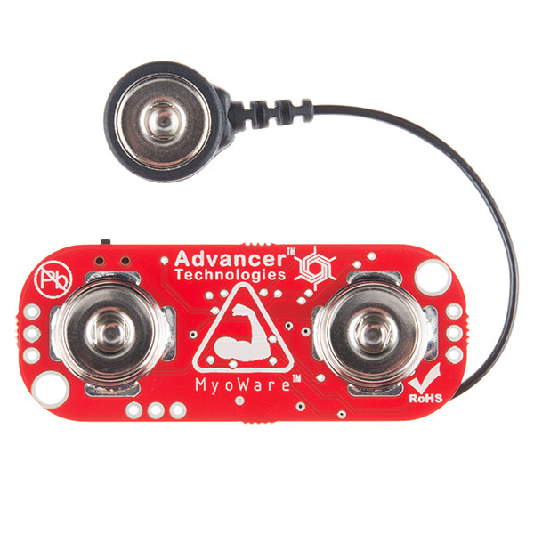

# Angular Cruise Hacknight

* [OpenBCI 8-channel Cyton board](#openbci-8-channel-cyton-board)
    * Requires USB dongle, includes 3D printed headset
* [OpenBCI 4-channel Ganglion board](#openbci-4-channel-ganglion-board)
    * Does not require USB dongle, does not include 3D printed Headset, just includes electrodes
* [Myo](#myo)
* [Neurosky MindWave - white headset](#neurosky-mindwave---white-headset)
    * Requires USB dongle
* [Neurosky MindWave Mobile - black headset](#neurosky-mindwave-mobile---black-headset)
    * Full bluetooth, does not require USB dongle
* [Muse](#muse)
* [Pulse Sensor - Heart-Rate Monitor](#pulse-sensor---heart-rate-monitor)
* [MyoWare Muscle Sensor](#myoware-muscle-sensor)

## OpenBCI 8-channel Cyton board

This headset includes a USB dongle and includes 3D printed headset.

Get up and running:

* $ git clone https://github.com/NeuroJS/angular-openbci-rx.git
    * This is the demo I used for my talk
* $ cd angular-openbci-rx
* $ npm install
* Plug in usb dongle
* Turn on OpenBCI headset (switch in the back)
* Wear headset
* $ npm start
* got to http://localhost:4300
* start hacking

Want to change the brainwaves before the get to the browser?
> Go to ./src/server/index.js
> See docs for [openbci-rx](https://github.com/NeuroJS/openbci-rx)

This project uses the Angular CLI so you can just run commands such as:
> ng generate component cool-brainwaves

[Product link](https://shop.openbci.com/collections/frontpage/products/cyton-biosensing-board-8-channel?variant=38958638542)

## OpenBCI 4-channel Ganglion board

Includes:

* [EMG/ECG Foam Solid Gel Electrodes](https://shop.openbci.com/collections/frontpage/products/skintact-f301-pediatric-foam-solid-gel-electrodes-30-pack?variant=29467659395)
* [EMG/ECG Snap Electrode Cables](https://shop.openbci.com/collections/frontpage/products/emg-ecg-snap-electrode-cables?variant=32372786958)

Get up and running:

* $ git clone https://github.com/NeuroJS/angular-openbci-rx.git
    * This is the demo I used for my talk
* $ cd angular-openbci-rx
* $ npm install
* Turn on OpenBCI headset (switch in the back)
* Wear headset
* $ npm start
* got to http://localhost:4300
* Go to ./src/server/index.js and replace `Cyton` with `Ganglion`
* start hacking

## Myo

Get up and running:

* $ git clone https://github.com/NeuroJS/angular-myo.git
    * This is the demo I used for my talk
* $ cd angular-myo
* $ npm install
* open project in your IDE
* Plug in usb dongle
* Myo is already on so just wear the armband
* $ npm start
* got to http://localhost:4400
* Check the [Myo API Docs](https://github.com/thalmiclabs/myo.js/blob/master/docs.md)
* start hacking 
    * Feel free to start at ./src/app/armband-slider

## Neurosky MindWave - white headset

Get up and running:

* [Download the Thinkgear connector](http://developer.neurosky.com/docs/doku.php?id=thinkgear_connector_tgc)
* Launch the ThinkGear connector
* [Download the MindWaveManager](http://download.neurosky.com/public/Products/MindWave%20headset/RF%20driver%20for%20Mac/MindWave%20Manager4.0.4.zip)
* Turn on headset
* Launch MindWaveManager and pair headset
* $ git clone https://github.com/NeuroJS/angular-neurosky.git
    * This is the demo I used for my talk
* $ cd angular-neurosky
* $ npm install
* open project in your IDE
* got to http://localhost:4500
* Check the [Node ThinkGear API Docs](https://github.com/afiedler/node-thinkgear-sockets)
* start hacking 
    * Feel free to start at ./src/app/attention and ./src/server/index.js

## Neurosky MindWave Mobile - black headset

* [Download the Thinkgear connector](http://developer.neurosky.com/docs/doku.php?id=thinkgear_connector_tgc)
* Launch the ThinkGear connector
* Turn on headset
* $ git clone https://github.com/NeuroJS/angular-neurosky.git
    * This is the demo I used for my talk
* $ cd angular-neurosky
* $ npm install
* open project in your IDE
* got to http://localhost:4500
* Check the [Node ThinkGear API Docs](https://github.com/afiedler/node-thinkgear-sockets)
* start hacking 
    * Feel free to start at ./src/app/attention and ./src/server/index.js

## Muse

Muse 2016 EEG Headset JavaScript Library (using Web Bluetooth)

This headset does not require a USB donlge. 

Get up and running:

* $ git clone https://github.com/urish/muse-js.git
    * This example was created by Uri Shaked
* $ cd muse-js
* $ npm install
* open project in your IDE
* Turn on the Muse headband
* $ npm start
* start hacking 

## Pulse Sensor - Heart-Rate Monitor

Includes a Photon microcontroller!

[Product link](https://shop.openbci.com/collections/frontpage/products/pulse-sensor?variant=22543672899)

More info coming soon.

## MyoWare Muscle Sensor

Includes a RedBear microcontroller!

[Product link](https://shop.openbci.com/collections/frontpage/products/myoware-muscle-sensor?variant=29472011267)

More info coming soon.
